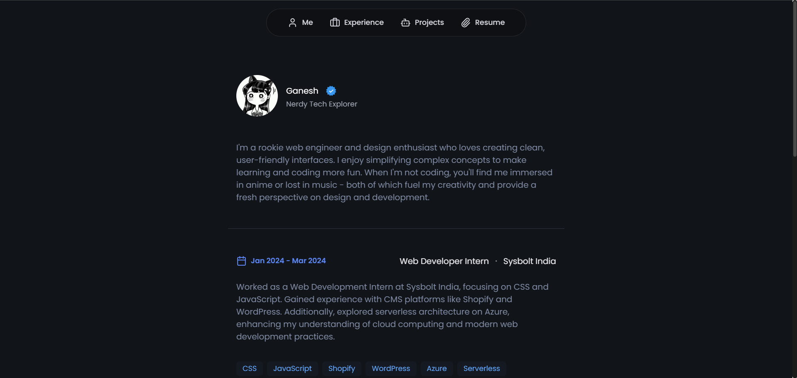
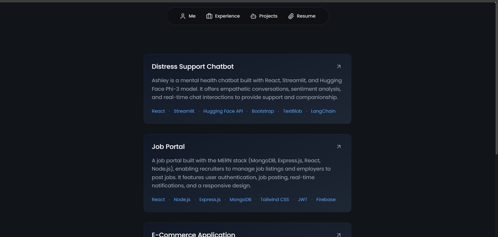
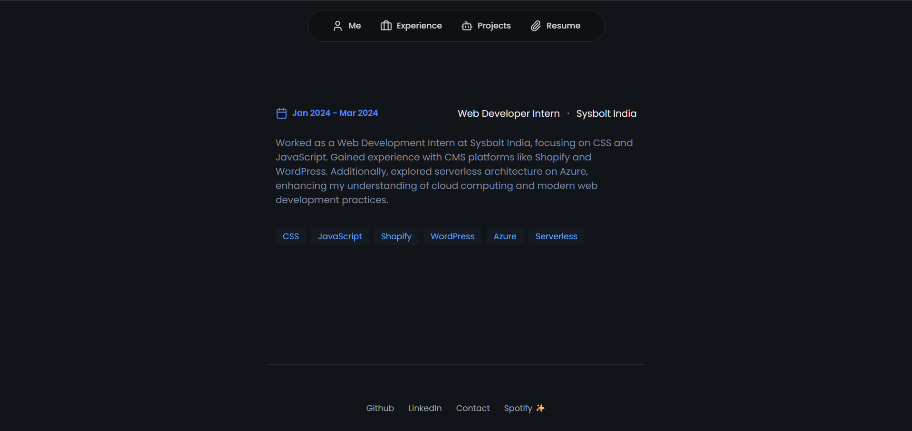

# 🌟 Minimalistic React Portfolio Template

Hey there! 👋 I'm excited to share my portfolio template with you. I built this using React, Vite, and Tailwind CSS to create a clean, modern portfolio that's super easy to customize. The best part? You just need to update one JSON file with your info, and you're good to go!

## 🎯 What Makes This Special?

I wanted to create something that's:
- 🌙 **Clean & Dark**: A sleek dark theme that's easy on the eyes
- 📱 **Responsive**: Looks great on everything from phones to desktops
- ⚡ **Fast**: Built with Vite for lightning-quick loading
- 🎨 **Easy to Make Your Own**: Just edit one JSON file!

## 👀 Take a Look!

Here's what you get:

| Home | Experience | Projects |
|------|------------|----------|
|  |  |  |

## 🚀 Getting Started

Super simple to get this running:

1. Clone it:
   ```bash
   git clone https://github.com/mc095/portfolio-template.git
   cd portfolio-template
   ```

2. Install stuff:
   ```bash
   npm install
   ```

3. Make it yours! Open `portfolio-template.json` and add:
   - 🎨 Your site config (title, favicon, etc.)
   - 👤 Your info (name, bio, profile pic)
   - 🔗 Your social links
   - 💼 Your experience
   - 🛠️ Your projects

4. Fire it up:
   ```bash
   npm run dev
   ```

## ⚙️ The Magic File

All your info goes in `portfolio-template.json`. Here's what you can customize:
- Site title & favicon
- Your name & bio
- Profile picture
- Social media links
- Work experience
- Projects

Just follow the structure in the file and replace my info with yours!

## 🛠️ Built With

- ⚛️ **React**: For the UI magic
- ⚡ **Vite**: Makes everything super fast
- 🎨 **Tailwind**: For styling without the hassle
- 🔄 **React Router**: Smooth navigation
- ✨ **Lucide Icons**: Pretty icons everywhere

## 💡 Hey, Want to Make It Better?

Found a bug? Got an idea? Feel free to:
- 🐛 Open an issue
- 🔨 Submit a pull request
- ⭐ Star the repo if you like it!

## 🤝 Use It!

Go ahead and use this template for your portfolio! All I ask is that you give it a star if you find it helpful 🌟


